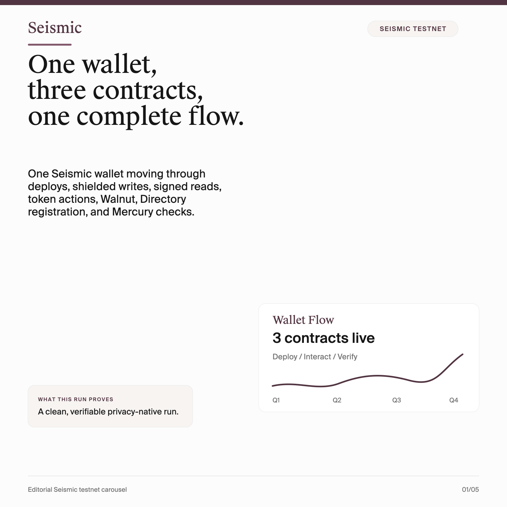
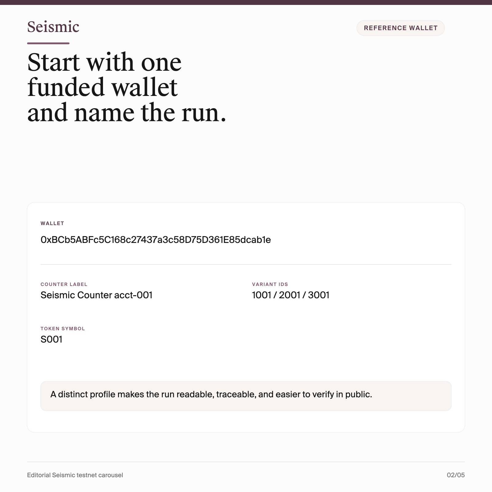
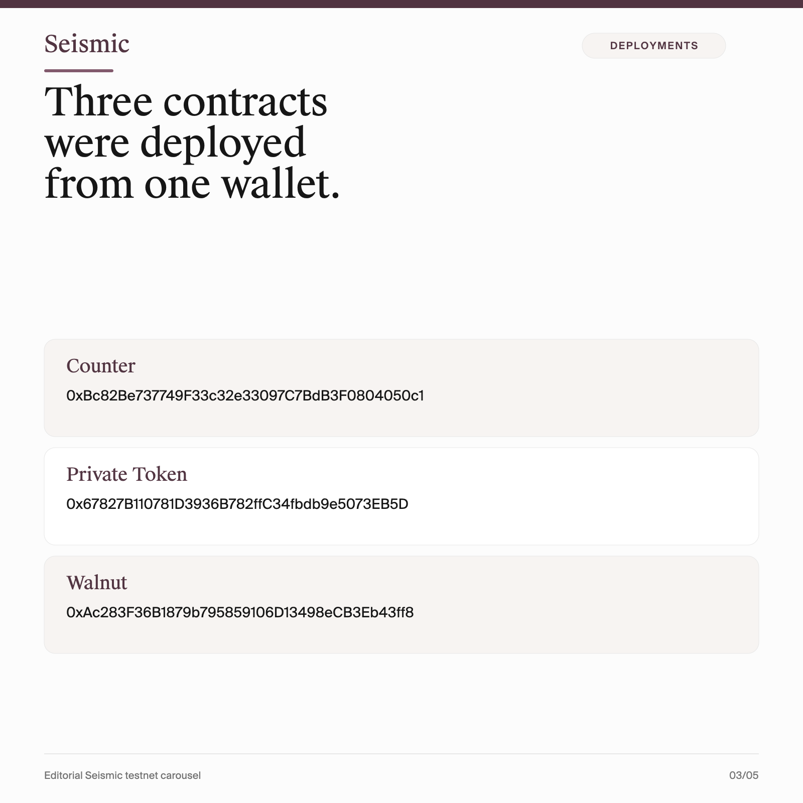
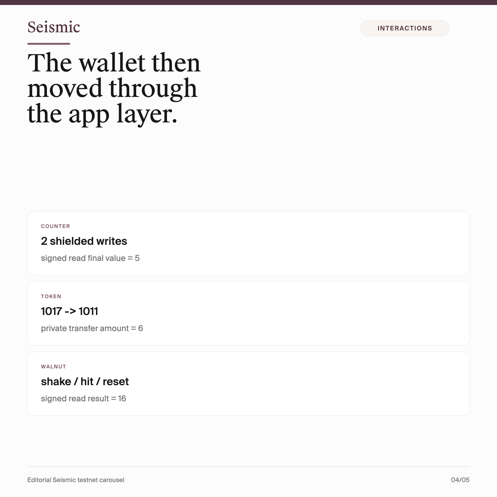

# Seismic Testnet Publication

  

  One wallet. Three contracts. One complete Seismic testnet flow.

This repository is a clean public package built around one complete Seismic testnet run.

Instead of showing a single deployment or a faucet screenshot, it documents a full privacy-native flow from one funded wallet:

- three contract deployments
- shielded writes
- signed reads
- a private token transfer
- Walnut interactions
- Directory viewing key registration
- Mercury precompile checks

## What's Inside

- [Step-by-step guide](./publication/guide.md)
- [Polished article](./publication/article.md)
- [PNG slide deck for X / Twitter](./publication/slides)

## Reference Run

Wallet:

`0xBCb5ABFc5C168c27437a3c58D75D361E85dcab1e`

Contracts:

- Counter: `0xBc82Be737749F33c32e33097C7BdB3F0804050c1`
- Private Token: `0x67827B110781D3936B782ffC34fbdb9e5073EB5D`
- Walnut: `0xAc283F36B1879b795859106D13498eCB3Eb43ff8`

## Why This Repo Exists

Seismic is easiest to understand when the flow is complete.

This repo is meant to show what a real one-wallet testnet path looks like when it includes both the application layer and the privacy infrastructure layer. The result is compact enough to share publicly, but specific enough to inspect and reproduce.

## Quick Results

- Counter final signed read: `5`
- Private token balance: `1017 -> 1011`
- Private token transfer amount: `6`
- Walnut final signed read: `16`
- Viewing key registration tx: `0xbe5fe0fc03eebc81847a78eb599911aec80ec306f2e5435ca717ccd4d35b5c53`

## Slide Preview

  
  
  

## How To Use This Repo

If you want the reproducible version, start with the guide:

- [Guide](./publication/guide.md)

If you want the publication-ready narrative, read:

- [Article](./publication/article.md)

If you want social assets:

- [Slides folder](./publication/slides)

## Notes

This repository intentionally excludes local automation scripts, account files, keys, proxies, and runtime outputs. It only contains the public publication package.
